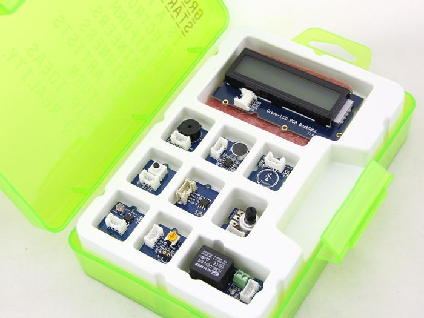
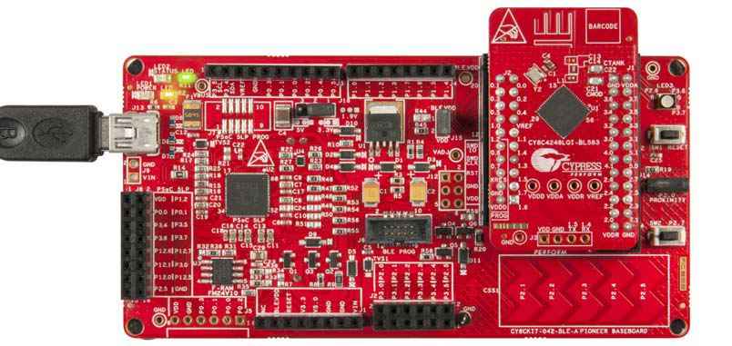
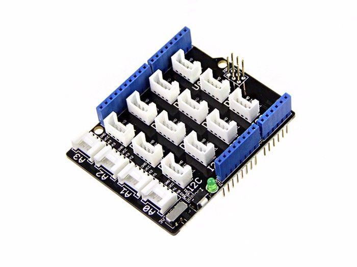
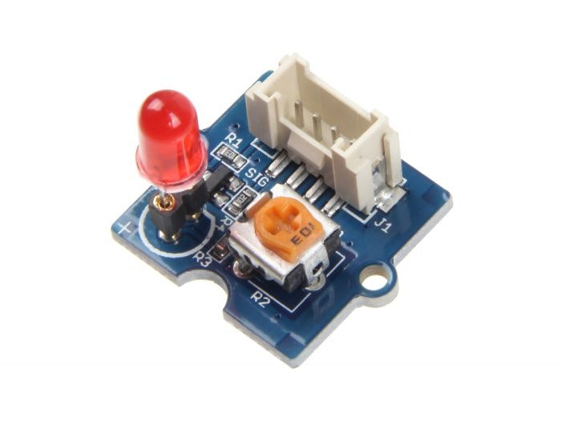
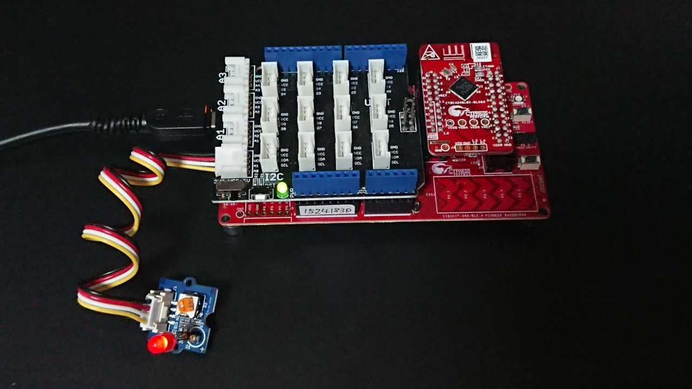
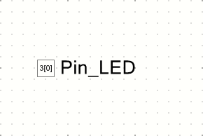

# CY8CKIT-042-BLE-A でＬチカ

これは、[PSoC Advent Calendar 2019]の1日目に突っ込まれた記事です。

## Groveのキットを買いました

もう半年以上も前になりますが、[スイッチサイエンス][Switch Science]さんで[Seeed Studio]さんが作っている[**Grove**][Grove]の[スターターキット][Grove Starter Kit]を買いました。
**Arduino**準拠のハードウェアなので、きっと手持ちの評価ボードで簡単に使えるだろうという安易な気持ちからでした。



今年の一連の記事は、このスターターキットを[**CY8CKIT-042-BLE-A Bluetooth Low Energy Pioneer Kit**][CY8CKIT-042-BLE-A]で使ってみます。


## Groveとは

私が考えるに、[**Grove**][Grove]というのは、ゆるいハードウェアの規格です。
4ピンのコネクタ形状が決められていて、そこにVCCとGNDと2本の信号線が通ります。
２本の信号線にはアナログでもディジタルでも通して使うことができます。
２本もあったら、I2CでもUARTでも通せるから十分だよね。

もっと詳しい解説は、[**Grove**][Grove]本家にあたってください。


## 本プロジェクトで目指すゴール

本プロジェクトでは、スターターキットに入っていた**LED**を点滅させることです。
最初はやっぱり、Ｌチカですね。


## 必要なハードウェア

[**CY8CKIT-042-BLE-A**][CY8CKIT-042-BLE-A]には、**Arduino**準拠コネクタが搭載されています。



一方、[スターターキット][Grove Starter Kit]には、[**Grove**][Grove]コネクタが満載された[**Base Shield V2**][Base Shield V2]が入っていました。



これを使えば、[**CY8CKIT-042-BLE-A**][CY8CKIT-042-BLE-A]でも[**Grove**][Grove]が使えるようになります。

あとは、[**Grove LED**][Grove LED]というボードにLEDを載せて[**Base Shield V2**][Base Shield V2]に接続したら準備完了です。
あぁ、このキットには、赤青緑の三色のLEDが入っているけれど、[**Grove LED**][Grove LED]ボードは一つしか入っていないのですね。



ところで、[**Base Shield V2**][Base Shield V2]の沢山あるコネクタのどれに接続したらいいんでしょう？



[**Base Shield V2**][Base Shield V2]には、シルク印刷で、それぞれのコネクタがどの信号に接続されるかが分かるようになっています。

例えば、**A0**と書かれているコネクタには、A0とA1の二つの信号が接続されます。
**Arduino**の場合、これらの信号はアナログ信号を意味するのですが、**PSoC**には関係ありません。
A0がP3[0]に、A1がP3[1]に電気的に接続されていて、それを何に使うのかは**PSoC**によって決められます。

[**Grove LED**][Grove LED]ボードは、A0が制御信号として使われて、A1は使われないようです。
このため、**PSoC**からP3[0]ピンを制御するとLEDが点滅します。


## プロジェクト - LChika

では、プロジェクトを作成しましょう。


### 回路図

プロジェクトでまず必要なのは、P3[0]を制御する方法を決める事です。
このプロジェクトでは、純粋にソフトウェアで制御を行う事にして、P3[0]にソフトウェア制御可能なGPIO出力を接続します。



端子の割り当てもお忘れなく。


### ソフトウェア

全てソフトウェアで制御することに決めたので、ソフトウェアディレイを使ったＬチカプログラムに仕立てました。

```c:main.c
#include "project.h"

int main(void) {
    CyGlobalIntEnable; /* Enable global interrupts. */

    for (;;) {
        CyDelay(500L);
        Pin_LED_Write(!Pin_LED_Read());
    }
}
```

以上でプロジェクトは完了です。
ビルドして書き込んだら、Ｌチカの出来上がりです。


## 関連サイト
* [32-bit ArmR CortexR-M0 PSoCR 4][PSoC 4]
* [PSoCR 4 BLE (Bluetooth Smart)][PSoC 4 BLE]
* [スイッチサイエンスのスターターキットのページ][ssci Starter Kit]

## 関連記事
* [CY8CKIT-042-BLE-A でＬチカ][GLChika]
* [CY8CKIT-042-BLE-A でLCD表示][GLCDShow]
* [CY8CKIT-042-BLE-A でバックライト点灯][GBLChika]
* [CY8CKIT-042-BLE-A で気圧を表示][GBarometer]
* [CY8CKIT-042-BLE-A で気圧を送信][GBLE]

[GLChika]:./README-LChika-ja.md
[GLCDShow]:./README-LCDShow-ja.md
[GBLChika]:./README-BLChika-ja.md
[GBarometer]:./README-Barometer-ja.md
[GBLE]:./README-BLE-ja.md
[PSoC Advent Calendar 2019]:https://qiita.com/advent-calendar/2019/psoc
[Switch Science]:https://www.switch-science.com/
[Seeed Studio]:https://www.seeedstudio.com/
[Grove]:https://www.seeedstudio.com/Grove
[Grove Starter Kit]:https://www.seeedstudio.com/Grove-Starter-Kit-for-Arduino-p-1855.html
[ssci Starter Kit]:https://www.switch-science.com/catalog/1812/
[CY8CKIT-042-BLE-A]:https://www.cypress.com/cy8ckit-042-ble-a
[Base Shield V2]:https://www.seeedstudio.com/Base-Shield-V2.html
[Grove LED]:https://www.seeedstudio.com/Grove-Red-LED.html
[PSoC 4]:http://www.cypress.com/psoc4
[PSoC 4 BLE]:https://www.cypress.com/products/psoc-4-ble-bluetooth-smart
[repository]:https://github.com/noritan/Advent2019
